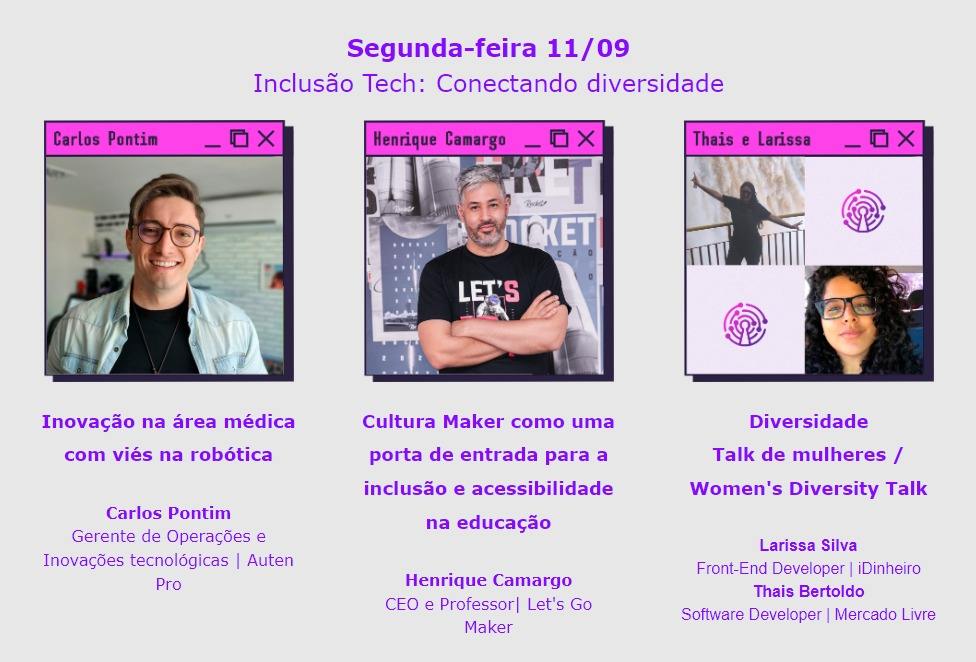
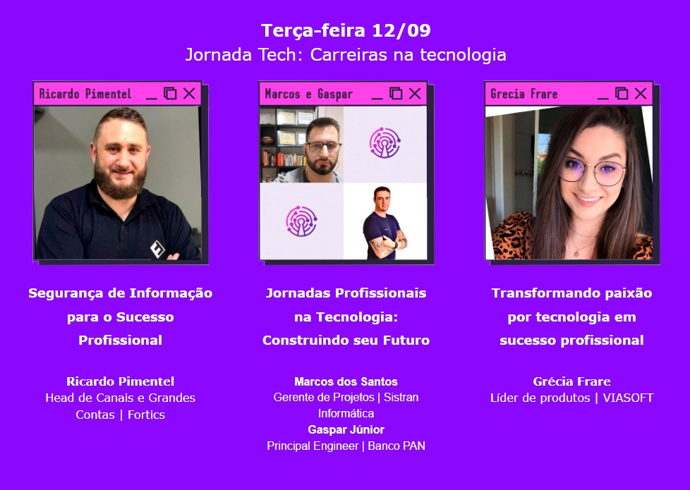
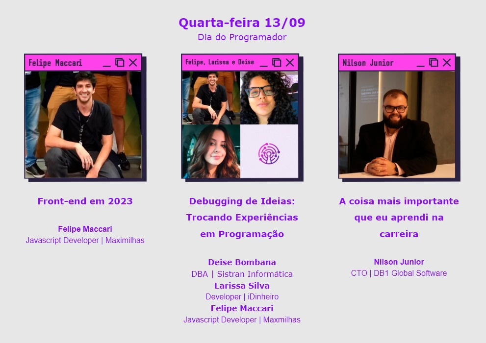
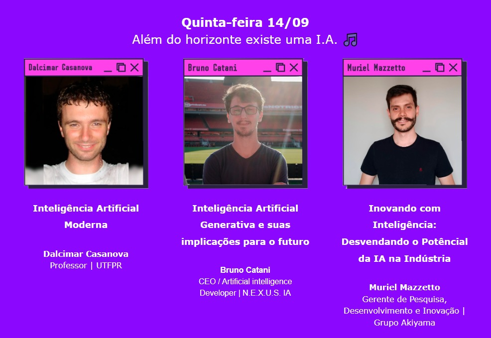
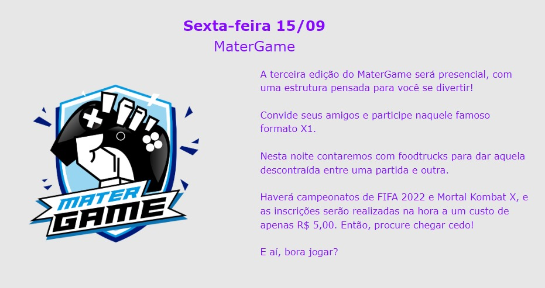

A Semana Acadêmica é um evento anual que reúne estudantes, profissionais e pesquisadores da área para promover a troca de conhecimento e atualizações sobre as últimas tendências e tecnologias do setor. Com palestras e apresentações, o evento oferece oportunidades de aprendizado, networking e incentiva a pesquisa. É uma oportunidade única para estudantes e profissionais se manterem atualizados e envolvidos no desenvolvimento.

------------------------------------------------------

<h1>Segunda-Feira: (11-09-2023) Inclusão Tech: Conectando diversidade.<h1>

------------------------------------------------------

<h1>Terça-Feira: (12-09-2023) Jornada Tech: Carreiras na tecnologia<h1>

------------------------------------------------------

<h1>Quarta-Feira: (13-09-2023) Dia do Programador.<h1>

------------------------------------------------------

<h1>Quinta-Feira (14-09-2023) Além do horizonte existe uma I.A.<h1>

------------------------------------------------------

<h1>Sexta-Feira (15-09-2023) MaterGame.<h1>

------------------------------------------------------

<h1>Patrocinadores e Apoiadores do Evento.<h1>

------------------------------------------------------

Inscreva-se! Link para o site da Semana Academica de Sistemas de Informação 2023.

https://quemfaz.materdei.edu.br/sasi

