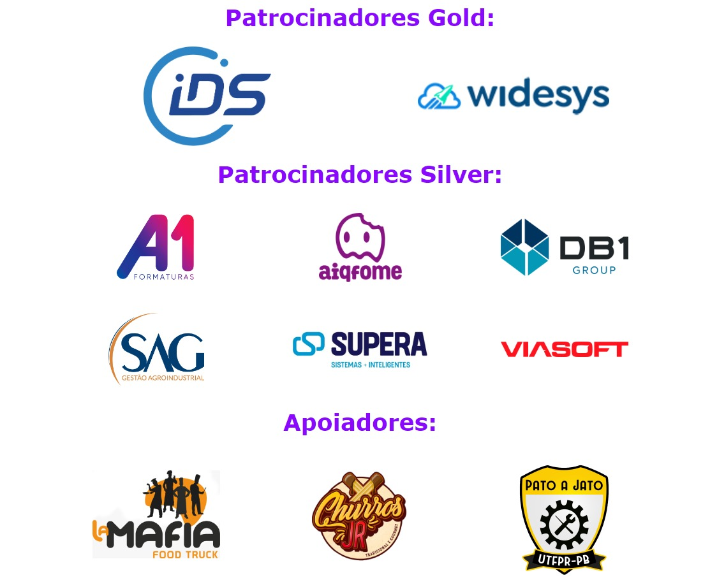

A Semana Acadêmica é um evento anual que reúne estudantes, profissionais e pesquisadores da área para promover a troca de conhecimento e atualizações sobre as últimas tendências e tecnologias do setor. Com palestras e apresentações, o evento oferece oportunidades de aprendizado, networking e incentiva a pesquisa. É uma oportunidade única para estudantes e profissionais se manterem atualizados e envolvidos no desenvolvimento.

------------------------------------------------------

<h1>Segunda-Feira.<h1>

------------------------------------------------------

<h1>Terça-Feira.<h1>

------------------------------------------------------

<h1>Quarta-Feira.<h1>

------------------------------------------------------

<h1>Quinta-Feira.<h1>

------------------------------------------------------

<h1>Sexta-Feira.<h1>

------------------------------------------------------

<h1>Patrocinadores e Apoiadores.<h1>

------------------------------------------------------

Inscreva-se! Link da Semana Academica de Sistemas de Informação 2023 abaixo.
https://quemfaz.materdei.edu.br/sasi

